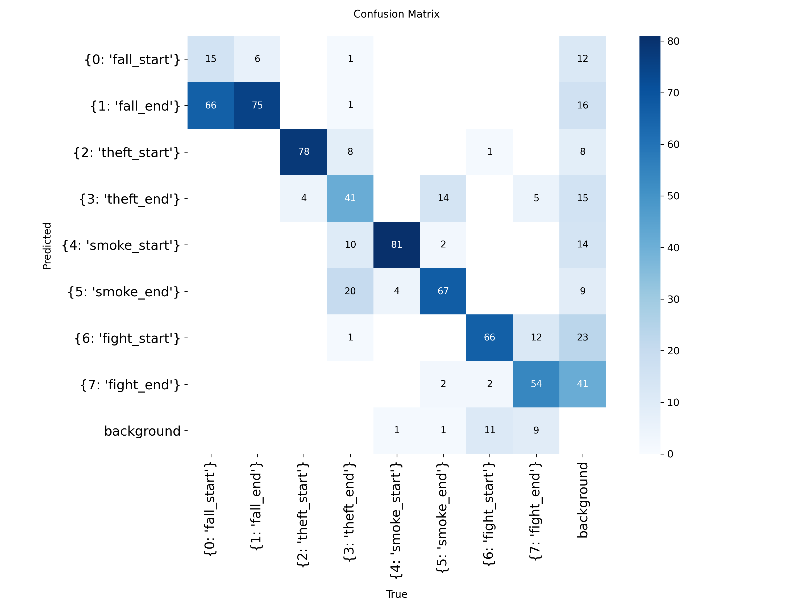
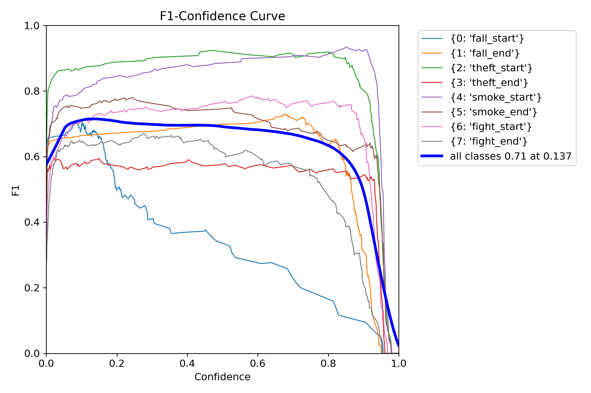
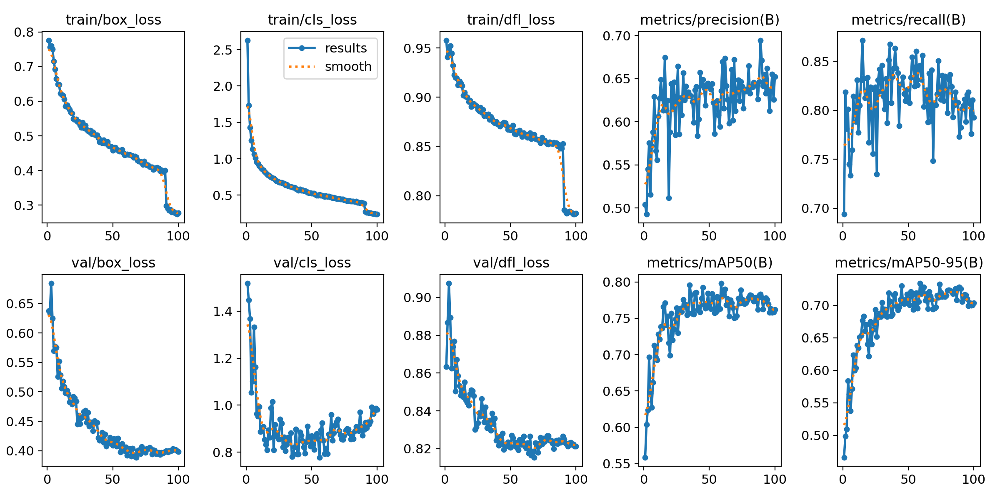
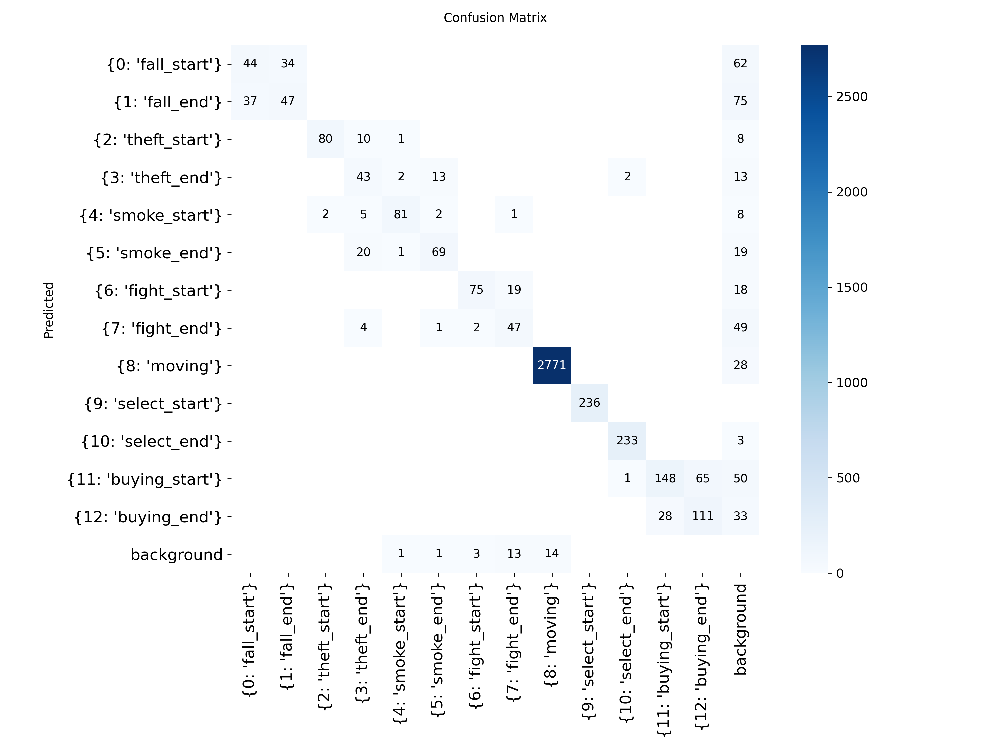
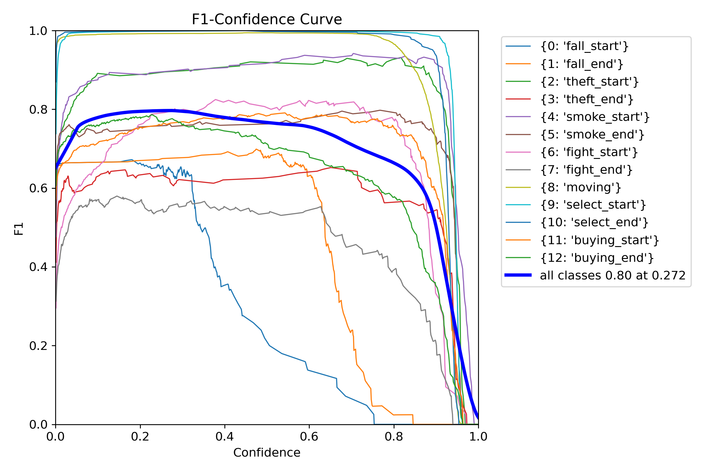

| [English](./README.md) | [Korean](./README/README_ko.md) |

   

</br>

# 🚨 **Smart Unmanned Store: YOLO AI Abnormal Behavior Detection & Alert App**

### Development Period

- **Overall Development**: 2025.04.29 - 2025.06.19
- **UI Implementation**: 2025.05.02 - 2025.05.15
- **Feature Implementation**: 2025.05.13 - 2025.06.19

</br>

For more details on the full project, please refer to the [CCTV_FE Repository](https://github.com/embedded-final-project-group-A/CCTV_FE).

This repository contains the training pipeline for the YOLOv8 model, which is used in the YOLO AI Abnormal Behavior Detection & Alert App. The model detects abnormal behaviors (such as falling, theft, smoking, fighting) and purchase-related behaviors (such as moving, selecting, purchasing start/end) from CCTV footage.

</br>

## 1. Project Structure

Here is the directory structure of key files in the project:

```markdown
📁 YOLO/                            # Top-level directory of the YOLO training project
├── README.md                      # Project description and usage instructions
├── train.py                       # YOLO training script
│
├── 📁 used/
│   ├── data.yaml                  # File defining paths to images/labels and class names
│   └── preprocess.py              # Converts XML+mp4 to YOLO labels + extracted images
│
└── 📁 result/                      # Training results (model weights)
    ├── 📁 only-anomaly/yolov8_final_project_238-2/weights
    │   ├── best.pt                # Best-performing model checkpoint
    │   └── last.pt                # Final epoch model checkpoint
    │
    └── 📁 yolov8_final_project/weights/
        ├── best.pt                # Best model trained on all behavior classes
        └── last.pt                # Last model trained on all behavior classes
```

</br>

## 2. Model Training

### Train Dataset

Training data was downloaded from AIHub:

**1. [Indoor (convenience store/shop) Human Abnormal Behavior Dataset](https://www.aihub.or.kr/aihubdata/data/view.do?currMenu=115&topMenu=100&searchKeyword=%EC%8B%A4%EB%82%B4(%ED%8E%B8%EC%9D%98%EC%A0%90,%20%EB%A7%A4%EC%9E%A5)%20%EC%82%AC%EB%9E%8C%20%EC%9D%B4%EC%83%81%ED%96%89%EB%8F%99%20%EB%8D%B0%EC%9D%B4%ED%84%B0&aihubDataSe=data&dataSetSn=71550)**

- Categories: Fall, Smoking, Theft, Fight
- **train** : 5,322
- **val** : 658

</br>

**2. [Indoor (convenience store/shop) Purchasing Behavior Dataset](https://www.aihub.or.kr/aihubdata/data/view.do?pageIndex=1&currMenu=115&topMenu=100&srchOptnCnd=OPTNCND001&searchKeyword=%EC%8B%A4%EB%82%B4%28%ED%8E%B8%EC%9D%98%EC%A0%90%2C+%EB%A7%A4%EC%9E%A5%29&srchDetailCnd=DETAILCND001&srchOrder=ORDER001&srchPagePer=20&srchDataRealmCode=&aihubDataSe=data&dataSetSn=71549)**

- Categories: Moving, Selecting, Purchasing
- **train** : 35,119
- **val** : 4,267

</br>

### Data Preprocessing


</br>

### Train Model

- **Epochs**: 100
- **Batch Size**: 16
- **Pretrained Model**: `yolov8n`
    - Version: [Ultralytics YOLOv8 v8.0+](https://github.com/ultralytics/ultralytics)
    - Lightweight YOLO model (`yolov8n.pt`) used as base

</br>

### Model Architecture

- **Backbone**: CSPDarkNet
- **Neck**: PAN-FPN
- **Head**: YOLO Detection Head
- **Activation**: SiLU (Sigmoid Linear Unit)

</br>

### Features & Design Highlights

- 13 behavior classes combined from two separate datasets
- Custom preprocessing pipeline to convert AIHub XML labels to YOLO format
- Extracted images from video at 10-frame intervals
- Custom `data.yaml` manually defined for 13 classes
- Image size: 640x640, batch size: 16, epochs: 100
- Default YOLOv8 anchor settings (auto anchor)
- Best-performing model saved as `best.pt` and used for inference

</br>

## 3. Anomaly-Only Model Performance

### Confusion Matrix


### F1 Score


### Precision


### Recall


### Preicision-Recall


### Others


</br>

## 4. Final Model Performance (All Classes)

### Confusion Matrix


### F1 Score


### Precision


### Recall


### Preicision-Recall


### Others


</br>

## 5. Code Reusability

### Main Code Functions

**preprocess.py**

- Reads XML labels and converts them to YOLO format
- Extracts frames from mp4 videos for training
- Supports both abnormal and purchasing behavior datasets
- Purchasing behavior dataset supports frame skipping (`FRAME_GAP`) to control image count

**train.py**

- Loads pretrained YOLOv8 model using Ultralytics library
- Trains the model with specified dataset and hyperparameters
- Outputs are saved to `runs/train/{name}` automatically

</br>

### Required Environment

- Python 3.8+
- OpenCV (`cv2`)
- Ultralytics YOLO (`pip install ultralytics`)
- Standard libraries (e.g., `xml.etree.ElementTree`)

</br>

### Data Preprocessing (`preprocess.py`)

```bash
python preprocess.py

```

- Parses XML label files and extracts images from videos, generating YOLO `.txt` labels
- Supports both 8 abnormal behavior classes and 5 purchasing behavior classes
- Make sure to adjust paths (`XML_DIR`, `VIDEO_DIR`, `OUTPUT_LABEL_DIR`, `OUTPUT_IMG_DIR`) in the script before running

</br>

### Install Ultralytics YOLO

```bash
git clone https://github.com/ultralytics/ultralytics.git
cd ultralytics
pip install -e .

```

</br>

### Training Configuration (data.yaml)

```yaml
train: path/to/train/images
val: path/to/val/images

nc: 13  # Number of classes (8 abnormal + 5 purchasing)
names: [
  0: "fall_start",
  1: "fall_end",
  2: "theft_start",
  3: "theft_end",
  4: "smoke_start",
  5: "smoke_end",
  6: "fight_start",
  7: "fight_end",
  8: "moving",
  9: "select_start",
  10: "select_end",
  11: "buying_start",
  12: "buying_end"
]

```

</br>

### Train the Model (`train.py`)

```bash
python train.py

```

- Loads the pretrained Ultralytics YOLOv8 model and trains it on the dataset
- Set the `data` parameter in `train.py` to the path of `data.yaml`
- You may also adjust `epochs`, `imgsz`, `batch`, `name` parameters as needed