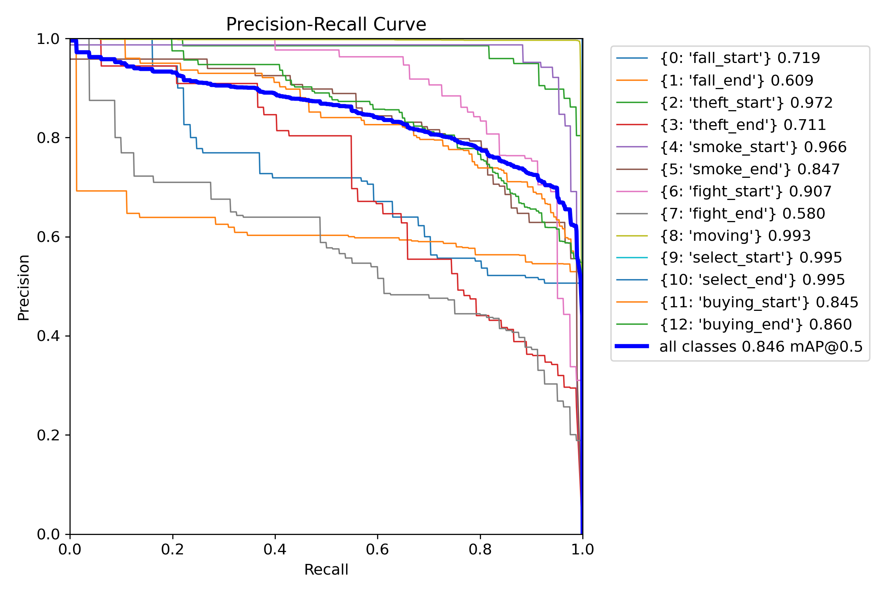

## YOLO
---

### **Model Installation**
---
To install the Ultralytics YOLO model, follow these steps:
```bash
git clone https://github.com/ultralytics/ultralytics.git
cd ultralytics
pip install -e .
```


### **Data**
---
Download the following datasets from AIHUB:

1. **Indoor (Convenience Store, Retail Store) Human Abnormal Behavior Data**
* **Download**: Falling, Smoking, Theft, Assault

2. **Indoor (Convenience Store, Retail Store) Purchasing Behavior Data**
* **Download**: Store movement, Selection, Purchase

**Number of Images Used**
* Indoor (Convenience Store, Retail Store) Human Abnormal Behavior Data
    * **Train**: 5322 images
    * **Validation**: 658 images
* Indoor (Convenience Store, Retail Store) Purchasing Behavior Data
    * **Train**: 35119 images
    * **Validation**: 4267 images

### **Training**
---
* **Epochs**: 100
* **Batch Size**: 16
* **Pretrained Model Used**: *yolov8n*
    * **Version**: [Ultralytics YOLOv8 v8.0+](https://github.com/ultralytics/ultralytics)
    * Trained based on the lightweight YOLO model (`yolov8n.pt`).

### **Model Architecture**
---
* **Backbone**: CSPDarkNet
* **Neck**: PAN-FPN
* **Head**: YOLO Detection Head
* **Activation**: SiLU (Sigmoid Linear Unit)


### **Implementation and Model Design Features**
---
* Composed of a total of 13 behavior classes, trained by integrating two different datasets.
* A preprocessing pipeline was built to convert AIHub XML labels to YOLO format.
* Training data was constructed by extracting images from videos (.mp4) at 10-frame intervals.
* The `data.yaml` file was manually created based on the 13 classes.
* Image Size: 640x640, Batch Size: 16, Epochs: 100
* Used YOLOv8 default anchor settings (auto anchor).
* The final model is saved as `best.pt` and will be used for subsequent inference.


### **Model Performance**
--- 
* **Confusion Matrix**


* **F1 Score**


* **Precision**


* **Recall**


* **Preicision-Recall**



* **Others**
