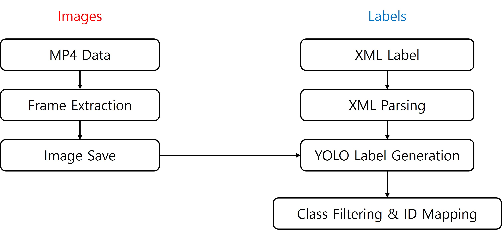
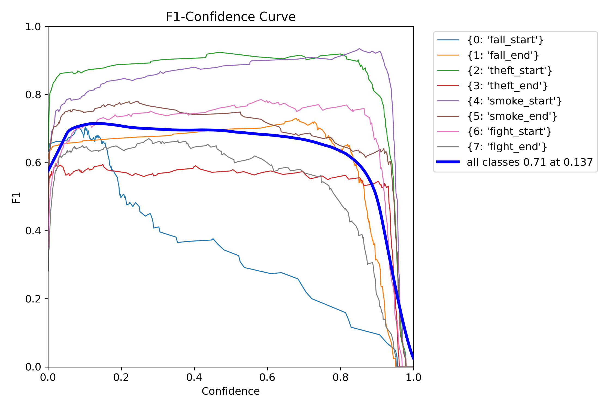
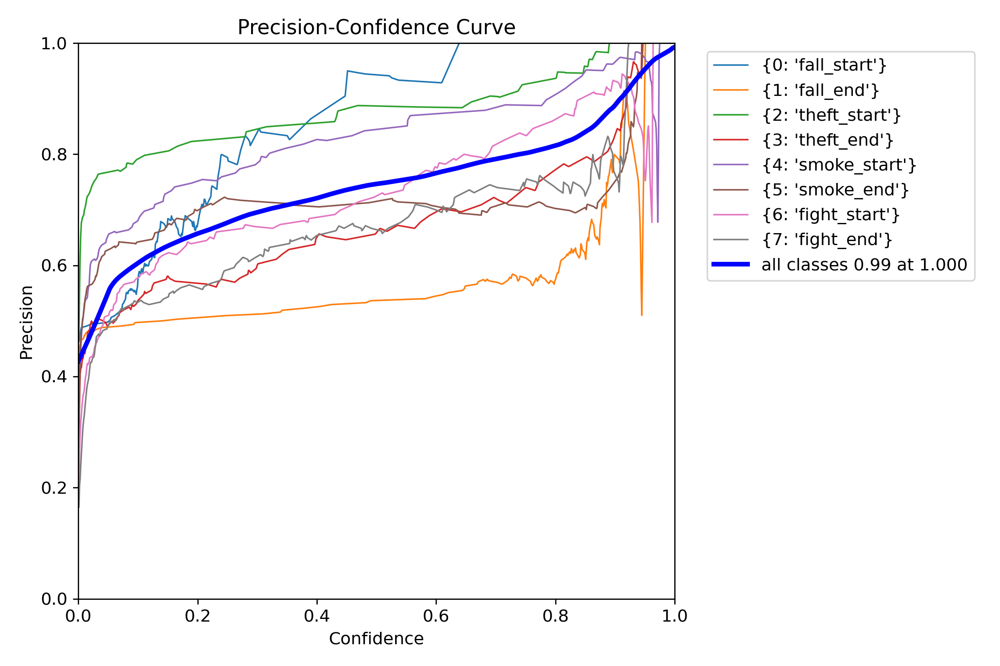
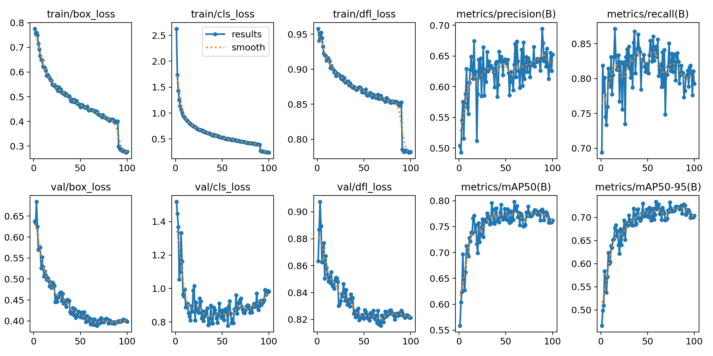
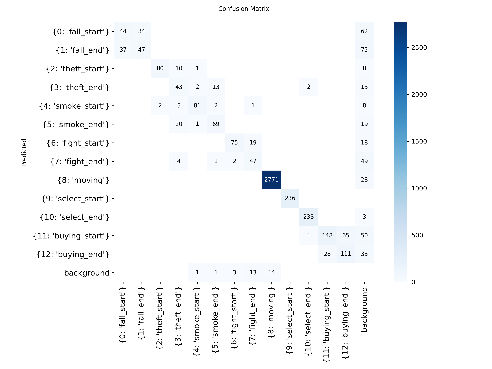
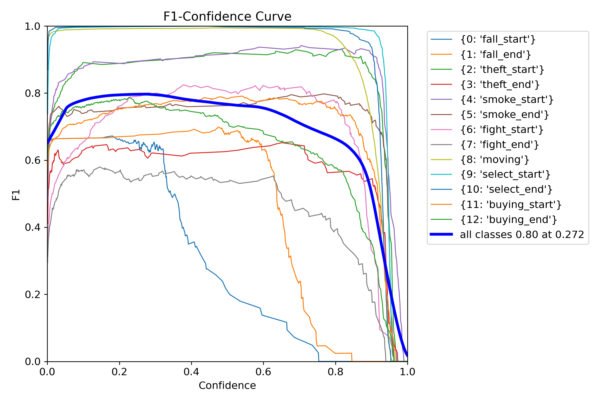
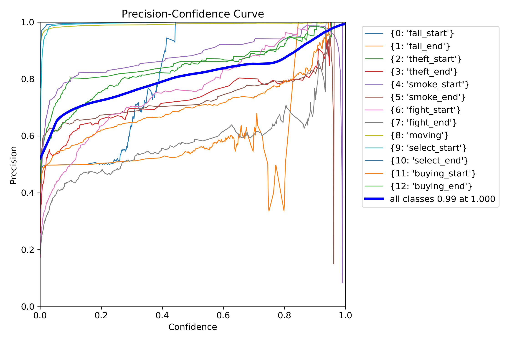
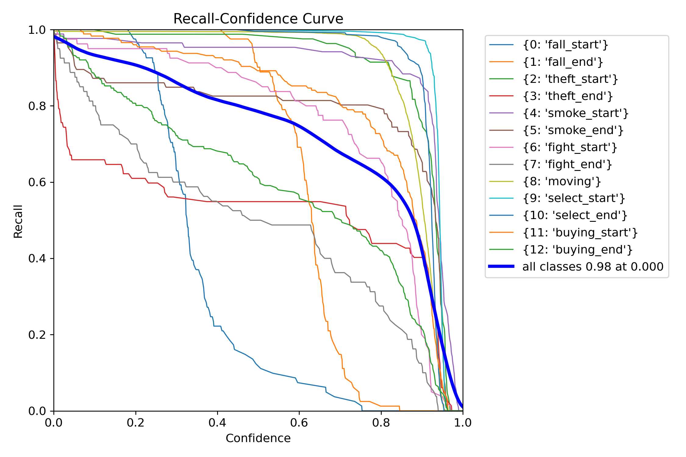
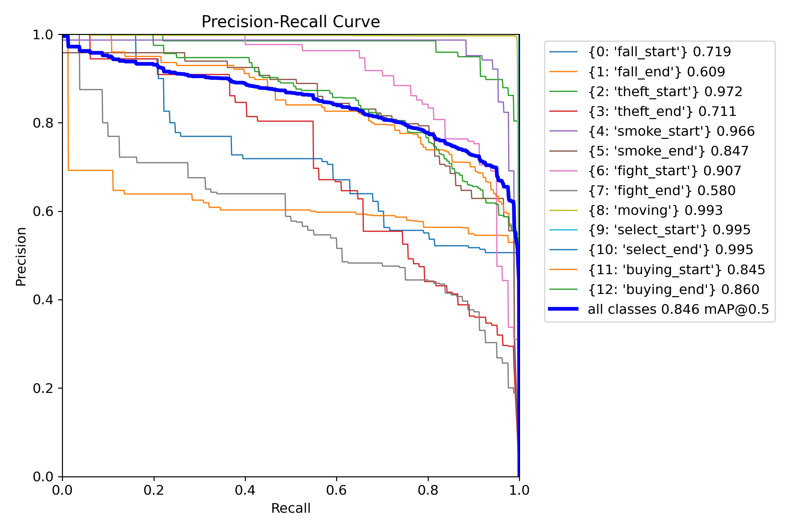
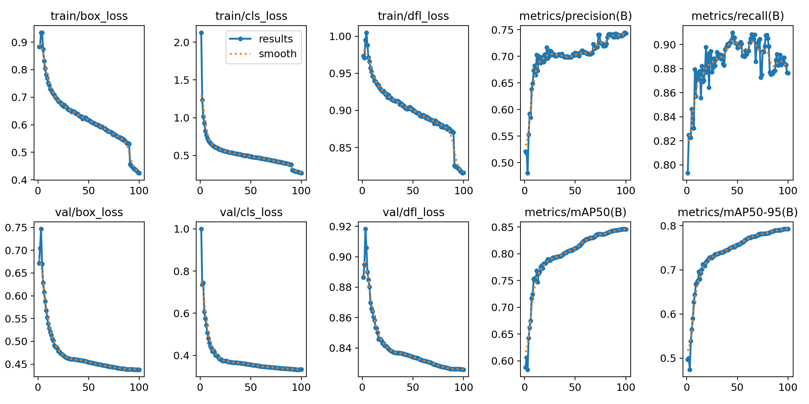

| [English](../README.md) | [Korean](./README_ko.md) |

   

</br>

# 🚨 **스마트 무인매장: YOLO AI 이상행동 감지 & 알람 앱**

### 개발 기간

- **전체 개발 기간**: 2025.04.29 - 2025.06.19
- **UI 구현**: 2025.05.02 - 2025.05.15
- **기능 구현**: 2025.05.13 - 2025.06.19

</br>

자세한 프로젝트 내용은 [CCTV_FE 레포지토리](https://github.com/embedded-final-project-group-A/CCTV_FE)를 참고하세요.

본 레포지토리는 YOLO AI 이상행동 감지 & 알람 앱에 사용하기 위해,  YOLOv8 모델을 학습하는 파이프라인입니다. CCTV 영상에서 이상행동(낙상, 도난, 흡연, 싸움 등)과 구매행동(이동, 선택, 구매 시작/종료 등)을 탐지합니다.

</br>

## 1. 프로젝트 구조

---

프로젝트에서 주요 파일들의 구조는 다음과 같습니다. 

```markdown
📁 YOLO/                  # YOLO 모델 학습 프로젝트 최상위 디렉토리
├── README.md             # 프로젝트 설명 및 사용법을 담은 문서
├── train.py              # YOLO 모델 학습 실행 스크립트
│
├── 📁 used/          
│   ├── data.yaml         # 학습에 사용할 이미지/라벨 경로 및 클래스 정의 파일
│   └── preprocess.py     # XML+mp4 → YOLO 라벨 + 이미지 변환 전처리 스크립트
│
└── 📁 result/                          # 학습 결과 (모델 가중치) 저장 폴더
    ├── 📁 only-anomaly/yolov8_final_project_238-2/weights 
    │   ├── best.pt                     # 검증 성능 기준 최고 모델 가중치
    │   └── last.pt                     # 마지막 에폭의 모델 가중치
    │
    └── 📁 yolov8_final_project/weights/  # 이상행동 + 구매행동 전체 학습 결과
        ├── best.pt                        # 전체 클래스 기준 최고 성능 모델
        └── last.pt                        # 전체 클래스 기준 마지막 학습 모델

```

</br>

## 2. Model Training

### Train Dataset

학습 데이터는 AIHub에서 다운로드받을 수 있습니다. 

**1. [실내(편의점, 매장) 사람 이상행동 데이터](https://www.aihub.or.kr/aihubdata/data/view.do?currMenu=115&topMenu=100&searchKeyword=%EC%8B%A4%EB%82%B4(%ED%8E%B8%EC%9D%98%EC%A0%90,%20%EB%A7%A4%EC%9E%A5)%20%EC%82%AC%EB%9E%8C%20%EC%9D%B4%EC%83%81%ED%96%89%EB%8F%99%20%EB%8D%B0%EC%9D%B4%ED%84%B0&aihubDataSe=data&dataSetSn=71550)**

- 전도, 흡연, 절도, 폭행 데이터 다운로드
- **train** : 5,322
- **val** : 658

**2. [실내(편의점, 매장) 구매행동 데이터](https://www.aihub.or.kr/aihubdata/data/view.do?pageIndex=1&currMenu=115&topMenu=100&srchOptnCnd=OPTNCND001&searchKeyword=%EC%8B%A4%EB%82%B4%28%ED%8E%B8%EC%9D%98%EC%A0%90%2C+%EB%A7%A4%EC%9E%A5%29&srchDetailCnd=DETAILCND001&srchOrder=ORDER001&srchPagePer=20&srchDataRealmCode=&aihubDataSe=data&dataSetSn=71549)**

- 매장이동, 선택, 구매 데이터 다운로드
- **train** : 35,119
- **val** : 4,267

</br>

### Data Preprocessing



</br>

### Train Model
- **epoch**: 100
- **batch size**: 16
- **사용한 pretrained model**: yolov8n
    - 버전 : [Ultralytics YOLOv8 v8.0+](https://github.com/ultralytics/ultralytics)
    - 경량화된 YOLO 모델('yolov8n.pt')을 기반으로 학습

</br>

### Model Architecture
- **Backbone**: CSPDarkNet
- **Neck**: PAN-FPN
- **Head**: YOLO Detection Head
- **Activation**: SiLU (Sigmoid Linear Unit)

</br>

### 구현 및 모델 설계 특징
- 총 13개의 행동 클래스로 구성되며, 서로 다른 두 데이터셋을 통합하여 학습
- AIHub XML 라벨을 YOLO 형식으로 변환하는 전처리 파이프라인을 구축
- 영상(mp4)에서 10프레임 간격으로 이미지 추출하여 학습 데이터 구성
- `data.yaml` 파일은 13개 클래스를 기반으로 직접 작성
- 이미지 크기: 640x640, batch size: 16, epoch: 100
- YOLOv8 기본 anchor 설정(auto anchor) 사용
- 최종 모델은 `best.pt`로 저장되며, 이후 추론에 활용

</br>

## 3. Anomaly 모델 성능

### Confusion Matrix


### F1 Score


### Precision


### Recall


### Preicision-Recall


### Others


</br>

## 4. Final 모델 성능

### Confusion Matrix


### F1 Score


### Precision


### Recall


### Preicision-Recall


### Others


</br>

## 5. 코드 재사용

### 주요 코드 기능

**preprocess.py**

- XML 라벨에서 객체 위치 정보를 읽어 YOLO 형식 라벨로 변환
- mp4 영상에서 해당 프레임 이미지를 추출하여 저장
- 이상행동과 구매행동 두 데이터셋 모두 처리
- 구매행동 데이터셋은 프레임 간격(`FRAME_GAP`)으로 이미지 개수 조절

**train.py**

- Ultralytics YOLO 라이브러리를 이용해 사전학습된 YOLOv8 모델 불러오기
- 지정한 데이터셋과 파라미터로 모델 학습 진행
- 학습 결과는 `runs/train/{name}` 폴더에 자동 저장

**필요 환경**

- Python 3.8 이상
- OpenCV (`cv2`)
- Ultralytics YOLO (설치: `pip install ultralytics`)
- 기타 라이브러리 (xml.etree.ElementTree 등 Python 표준 라이브러리 포함)

</br>

### 데이터 전처리 (`preprocess.py`)

```powershell
python preprocess.py
```

- XML 라벨 파일과 mp4 영상을 읽어 프레임 이미지와 YOLO 형식 라벨(txt)를 생성합니다.
- 이상행동 데이터(8개 클래스)와 구매행동 데이터(5개 클래스)에 대해 각각 처리하며, 구매행동은 프레임 간격을 두어 이미지 개수를 조절합니다.
- 스크립트 내 경로(`XML_DIR`, `VIDEO_DIR`, `OUTPUT_LABEL_DIR`, `OUTPUT_IMG_DIR`)를 실제 경로에 맞게 수정 후 실행하세요.

</br>

### 모델 설치

```powershell
git clone https://github.com/ultralytics/ultralytics.git
cd ultralytics
pip install -e .
```

</br>

### 학습 설정 (data.yaml)

```powershell
train: path/to/train/images
val: path/to/val/images

nc: 13 # 클래스 수 (이상행동 8 + 구매행동 5)
names : [
  0 : "fall_start", 
  1 : "fall_end", 
  2 : "theft_start", 
  3 : "theft_end", 
  4 : "smoke_start", 
  5 : "smoke_end", 
  6 : "fight_start", 
  7 : "fight_end",
  8 : "moving",
  9 : "select_start",
  10 : "select_end",
  11 : "buying_start",
  12 : "buying_end"
]

```

</br>

### 모델 학습 (`train.py`)

```powershell
python train.py
```

- Ultralytics YOLOv8 사전학습 모델을 불러와서 데이터셋으로 학습합니다.
- `train.py`에서 `data` 파라미터에 위 `data.yaml` 경로를 지정합니다.
- 필요에 따라 `epochs`, `imgsz`, `batch`, `name` 파라미터를 조절할 수 있습니다.